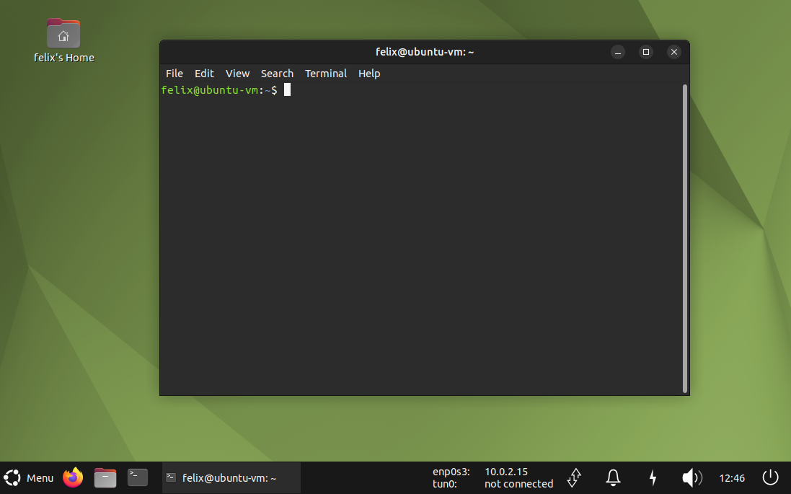

# ctftoolkit

*ctftoolkit* transforms Ubuntu into a pentesting distribution by installing a few tools I usually use when playing CTFs.
This script was tested on Ubuntu MATE 24.04.2 LTS.

```
          __    _____  __                .__   __   .__  __
    _____/  |__/ ____\/  |_  ____   ____ |  | |  | _|__|/  |_ 
  _/ ___\   __\   __\\   __\/  _ \ /  _ \|  | |  |/ /  \   __\
  \  \___|  |  |  |   |  | (  <_> |  <_> )  |_|    <|  ||  |
   \___  >__|  |__|   |__|  \____/ \____/|____/__|_ \__||__|
       \/                                          \/

  Version: 1.0.0 - 2024/02/07
  GitHub: github.com/FelixSchuster


  Usage: ctftoolkit.sh [option]

  Options:
    -h, --help              Display this help message
    -m, --mate              Configure the mate desktop environment
    -r, --regular-tools     Install regular tools
    -p, --pentest-tools     Install pentest tools and regular tools
```

I recently added a script to install the Mate desktop environment on Kali as well.
Check the contents of the `kali` folder for further information.

# Setup
```
git clone https://github.com/FelixSchuster/ctftoolkit.git
cd ctftoolkit
sudo chmod +x ctftoolkit.sh
sudo ./ctftoolkit.sh
```
Note that `ctftoolkit.sh` relies on resources located in `./templates`.
Ensure to clone the entire repository, as if the script fails to resolve dependencies, it may not function as intended.

# Options

## -m, --mate
Configures the Mate desktop environment as shown below.
Adds a script to display IP addresses in the taskbar and enables unlimited scrollback in the terminal
If your network interfaces are named differently, edit the script located in `/opt/ctftoolkit/templates/display_ips.sh`.



## -r, --regular-tools
Installs/downloads the following tools:

- snap
- curl
- docker compose
- net-tools
- wireless-tools
- visual studio code

## -p, --pentest-tools

Installs/downloads all the regular tools plus:
- pip
- pipx
- rubygems
- ansible
- searchsploit
- nmap
- nikto
- zaproxy
- sqlmap
- smbclient
- proxychains
- metasploit framework
- mitm6
- impacket
- hashcat
- aircrack-ng
- hcxtools
- enum4linux
- xfreerdp
- wfuzz
- wpscan
- fcrackzip
- exiftool
- john
- bloodhound community edition
- seclists
- mimikatz
- winpeas
- linpeas
- netexec
- evil-winrm
- gobuster
- kerbrute
- responder
- ghidra 11.1.2
- nessus
- burpsuite 2024.5.5
- ntlm_theft
- wireshark

# Disclaimer
I am not responsible for any damage caused to your system. Some of the changes made by the script might be considered insecure. It is recommended run the script in virtual machines only.

This script is inspired by [pimpmykali](https://github.com/Dewalt-arch/pimpmykali.git) created by Dewalt.
